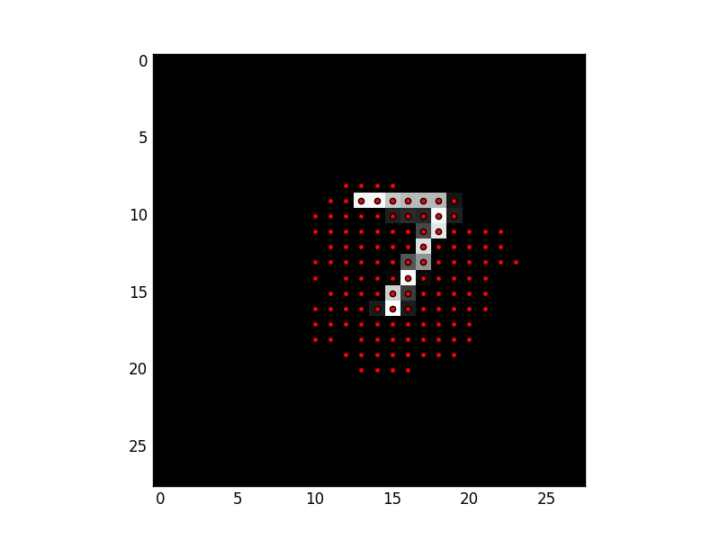

# Deformable Convolutional Networks

This is an implementation of [Deformable Convolutional Networks](https://arxiv.org/abs/1703.06211).

## Installation

```
pip install git+https://github.com/yuyu2172/chainer.git@deformable
pip install chainercv
```

##### Dependencies

+ Chainer with Deformable Covolution, which is implmented in my fork repository of Chainer. The corresponding PR can be found at https://github.com/pfnet/chainer/pull/2468 .

+ [ChainerCV](https://github.com/pfnet/chainercv): version 0.45 or later.


## Implementation

Implementation of deformable convolution can be found at my [fork repository of Chainer](https://github.com/yuyu2172/chainer/blob/deformable/chainer/functions/connection/deformable_convolution_2d_sampler.py).

## Experiments

You can start experiments with following commands.

```
cd experiments
# with deformable convolution
python train_mnist.py --gpu GPU --deformable 1

# without deformable convolution
python train_mnist.py --gpu GPU --deformable 0
```


You can verify how gradients propagate from the center of feature map with the following commands.
A sample output of the visualization is found below the commands.

```
cd experiments
# with deformable convolution
python test_mnist.py --deformable 1 --resume result/model_iter_20

# without deformable convolution
# python test_mnist.py --deformable 0 --resume result/non_deformable_20
```




Visualization of the dataset used in the experiment can be found [here](notebooks/visualize_scale_mnist.ipynb).

#### Results on a convnet without Deformable Convolutions

```
epoch       main/loss   validation/main/loss  main/accuracy  validation/main/accuracy  elapsed_time
1           0.708221    0.283162              0.768484       0.9126                    18.7896       
2           0.263077    0.189404              0.921934       0.9428                    37.5817       
3           0.193947    0.152032              0.942317       0.955                     56.3724       
4           0.163748    0.115457              0.951117       0.9642                    75.1908       
5           0.140286    0.114538              0.956984       0.9633                    94.0165       
6           0.126504    0.110267              0.96125        0.9645                    112.281       
7           0.115937    0.0970335             0.964351       0.9719                    131.185       
8           0.106651    0.0958874             0.96725        0.9682                    150.184       
9           0.103688    0.0858868             0.9687         0.9745                    169.14        
10          0.096731    0.0829538             0.969999       0.9754                    188           
11          0.091497    0.0754935             0.9713         0.9752                    206.788       
12          0.0891918   0.0804935             0.972866       0.9751                    225.17        
13          0.0858997   0.0755802             0.973216       0.9773                    244.171       
14          0.0810177   0.0712489             0.9747         0.9778                    263.432       
15          0.0786763   0.0675007             0.9754         0.9789                    282.178       
16          0.0764377   0.0700318             0.9766         0.9779                    300.879       
17          0.0771241   0.0718489             0.975933       0.9793                    320.261       
18          0.0713135   0.0671539             0.978182       0.9786                    338.751       
19          0.0704125   0.0653125             0.977932       0.9797                    357.405       
20          0.0732299   0.0686064             0.977299       0.9773                    375.998       
```


#### Results on a convnet with Deformable Convolutions

```
epoch       main/loss   validation/main/loss  main/accuracy  validation/main/accuracy  elapsed_time
1           0.602866    0.213261              0.803917       0.9384                    108.512       
2           0.184128    0.1528                0.945034       0.9537                    219.172       
3           0.132774    0.121223              0.95995        0.9613                    331.241       
4           0.113963    0.0807695             0.96605        0.9754                    406.211       
5           0.101552    0.0793125             0.968783       0.9737                    454.981       
6           0.0892582   0.0723555             0.972516       0.9772                    504.614       
7           0.0850104   0.0705336             0.974182       0.9783                    553.137       
8           0.0810863   0.0647341             0.974583       0.9804                    601.335       
9           0.0765612   0.0690268             0.9763         0.9777                    649.465       
10          0.0706512   0.0562773             0.977965       0.9815                    697.64        
11          0.0688571   0.0626049             0.978165       0.9795                    745.871       
12          0.066559    0.0629075             0.979365       0.9799                    794.023       
13          0.0620674   0.0630466             0.980083       0.9803                    842.183       
14          0.0630138   0.0546333             0.980416       0.9824                    890.337       
15          0.0579044   0.0607682             0.982132       0.981                     938.424       
16          0.0584699   0.0451323             0.981932       0.9843                    986.574       
17          0.0563529   0.0610969             0.982615       0.9807                    1034.81       
18          0.0538641   0.0421436             0.982982       0.9862                    1082.96       
19          0.0556291   0.0502835             0.982833       0.9857                    1131.11       
20          0.0523559   0.0475166             0.983316       0.9853                    1179.27       
```
